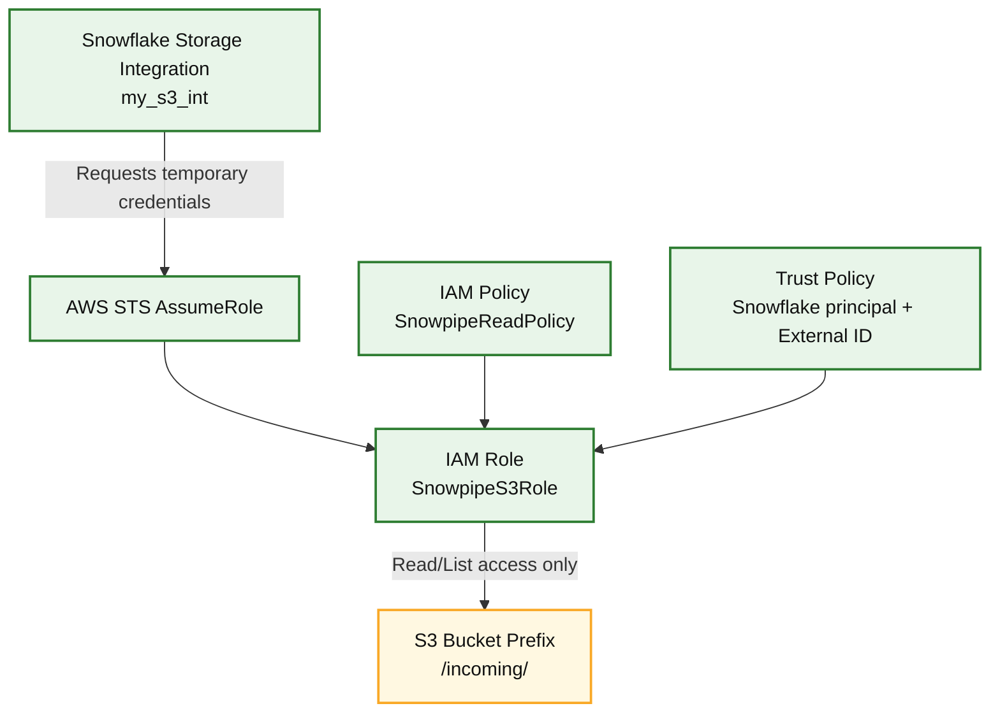
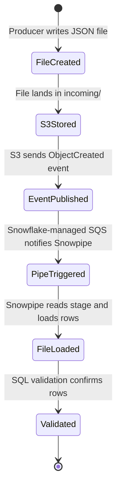
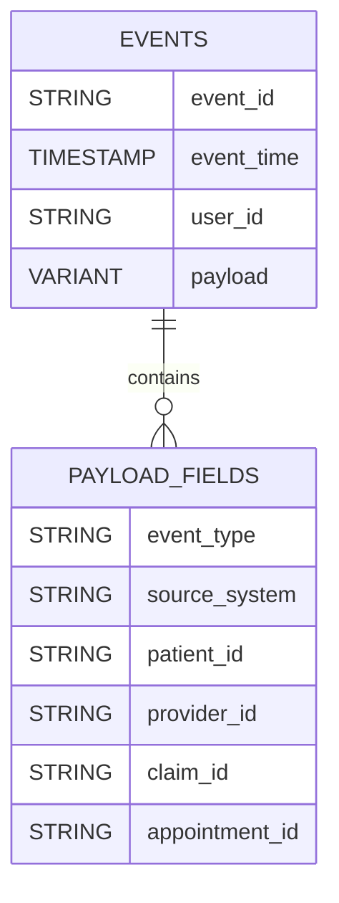
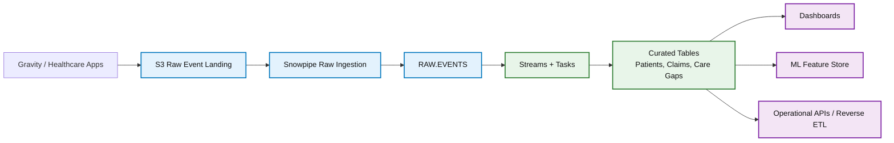

# Snowpipe S3 Real-Time Ingestion Pipeline

<p align="center">
  
  
  
  
  
</p>

<p align="center">
  <strong>Event-driven AWS S3 to Snowflake ingestion pipeline using Snowpipe auto-ingest, IAM role-based security, external stages, and realistic healthcare/operations test data.</strong>
</p>

<p align="center">
  <strong>Made by Aakar Gupta</strong>
</p>

---

## Repository Metadata

| Field | Value |
|---|---|
| Repository name | `snowpipe-s3-realtime-ingestion` |
| Made by | Aakar Gupta |
| Description | Event-driven S3 to Snowflake ingestion pipeline with Snowpipe, IAM storage integration, S3 event notifications, and healthcare-oriented event data |
| Primary domain | Cloud data engineering |
| Secondary domain | Healthcare analytics and operational data platforms |
| Suggested tags | `snowflake`, `snowpipe`, `aws-s3`, `iam`, `data-engineering`, `elt`, `real-time-ingestion`, `healthcare-data`, `json`, `cloud-pipeline` |
| Sensitive data policy | Uses placeholders only; no screenshots, account IDs, secrets, personal credentials, or generated auth values are committed |

<div style="border-left: 6px solid #2e7d32; background: #edf7ed; padding: 12px 16px; margin: 16px 0;">
<strong>Project result:</strong> The pipeline loads JSON files from an S3 <code>incoming/</code> prefix into a Snowflake raw table automatically using Snowpipe auto-ingest.
</div>

---

## Table of Contents

1. [Executive Summary](#executive-summary)
2. [Conceptual Background](#conceptual-background)
3. [Why Snowflake Is Useful Here](#why-snowflake-is-useful-here)
4. [Architecture](#architecture)
5. [Implementation Blueprint](#implementation-blueprint)
6. [Repository Structure](#repository-structure)
7. [Configuration Placeholders](#configuration-placeholders)
8. [Step-by-Step Implementation](#step-by-step-implementation)
9. [Test Data](#test-data)
10. [Validation Queries](#validation-queries)
11. [Security Model](#security-model)
12. [Future Uses](#future-uses)
13. [Troubleshooting](#troubleshooting)
14. [Guides](#guides)

---

## Executive Summary

Modern analytics systems often need to ingest files as soon as they arrive, without waiting for a manually scheduled batch job. This project implements that pattern using:

- **Amazon S3** as the landing zone for event files.
- **AWS IAM** as the security layer for controlled bucket access.
- **Snowflake Storage Integration** to avoid static cloud credentials.
- **Snowflake External Stage** to represent the S3 path inside Snowflake.
- **Snowpipe Auto-Ingest** to load data automatically after S3 object creation events.
- **Snowflake VARIANT** to store flexible semi-structured JSON payloads.

The repository is intentionally written like a professional implementation package: it includes SQL scripts, operational guides, test data, expected results embedded in the setup and validation steps, troubleshooting notes, and a privacy-safe README.

### Final Pipeline Flow

```text
Source application -> S3 incoming/ folder -> S3 event notification -> Snowflake-managed SQS -> Snowpipe -> INGEST_DB.RAW.EVENTS
```

---

## Conceptual Background

### What Is Snowpipe?

Snowpipe is Snowflake's continuous data loading service. Instead of running manual `COPY INTO` commands every time a new file arrives, Snowpipe listens for file arrival notifications and loads the file into a table.

Snowpipe is commonly used for:

- Event ingestion
- Application logs
- IoT telemetry
- Claims and healthcare feeds
- Operational platform events
- Semi-structured JSON landing zones

### What Is an External Stage?

An external stage is a Snowflake object that points to a cloud storage location such as S3. It lets Snowflake refer to external files using SQL syntax:

```sql
LIST @RAW.my_s3_stage;
```

In this project, the stage points to:

```text
s3://<S3_BUCKET>/incoming/
```

### What Is a Storage Integration?

A storage integration is Snowflake's secure abstraction for cloud storage access. It lets Snowflake assume an AWS IAM role rather than using hardcoded AWS access keys.

This is important because:

- Credentials are not embedded in SQL scripts.
- AWS access can be scoped to a single bucket and prefix.
- Trust is controlled by IAM role policies.
- The External ID helps protect against confused-deputy risks.

### Why Use JSON and VARIANT?

Healthcare and platform events often change over time. A care gap event, claims event, appointment event, and outreach event do not all have the same fields. Snowflake's `VARIANT` type stores flexible JSON while still allowing SQL queries over nested values.

Example:

```sql
SELECT payload:event_type::STRING AS event_type
FROM INGEST_DB.RAW.EVENTS;
```

---

## Why Snowflake Is Useful Here

Snowflake is useful for this project because it combines storage, compute, semi-structured data handling, and cloud integrations in one platform.

| Snowflake Capability | Why It Matters |
|---|---|
| Separate storage and compute | Ingestion workloads can scale without tightly coupling storage and compute |
| `VARIANT` support | Raw JSON can be loaded without flattening every field upfront |
| Snowpipe | New S3 files can load automatically with low operational overhead |
| External stages | S3 data can be queried and loaded without moving it manually first |
| SQL over semi-structured data | Teams can query nested JSON fields directly |
| Copy history and pipe status | Operational monitoring is available inside Snowflake |
| Streams and tasks | Future transformations can be automated inside Snowflake |
| Secure integrations | IAM roles and External IDs reduce credential exposure |

### Moving Forward With Snowflake

This raw ingestion layer can become the foundation for a larger Snowflake data platform:

1. **Raw layer:** Load source events exactly as received.
2. **Staging layer:** Clean, standardize, and validate fields.
3. **Curated layer:** Build analytics-ready tables for patients, care gaps, claims, providers, and outreach.
4. **Serving layer:** Expose dashboards, reverse ETL outputs, or downstream application feeds.

For a future Innovaccer Gravity-style integration, Snowflake can act as a central analytical and interoperability layer between event streams, quality measures, claims feeds, and care management workflows.

---

## Architecture

### High-Level System Architecture

```mermaid
flowchart LR
    A["Source Systems<br>Applications, Gravity-like workflows, APIs"] -->|"Write JSON event files"| B["Amazon S3<br><S3_BUCKET>/incoming/"]
    B -->|"ObjectCreated notification"| C["S3 Event Notification"]
    C -->|"Message delivered"| D["Snowflake-managed SQS Queue"]
    D -->|"Auto-ingest trigger"| E["Snowpipe<br>RAW.my_events_pipe"]
    E -->|"COPY INTO with JSON transform"| F["Snowflake RAW.EVENTS"]
    F --> H["Validation Queries"]
    F --> I["Future Curated Models"]

    classDef aws fill:#fff3e0,stroke:#ef6c00,stroke-width:2px,color:#111;
    classDef snowflake fill:#e3f2fd,stroke:#0277bd,stroke-width:2px,color:#111;
    classDef future fill:#f3e5f5,stroke:#7b1fa2,stroke-width:2px,color:#111;

    class B,C,D aws;
    class E,F,H snowflake;
    class A,I future;
```



### Security Architecture



### Data Lifecycle



### Data Model



---

## Implementation Blueprint

| Phase | Component | Purpose | Output |
|---|---|---|---|
| 1 | Snowflake database setup | Create compute and target landing table | `INGEST_WH`, `INGEST_DB`, `RAW.EVENTS` |
| 2 | AWS S3 setup | Create cloud landing zone | `<S3_BUCKET>/incoming/` |
| 3 | IAM policy | Grant scoped S3 access | `SnowpipeReadPolicy` |
| 4 | IAM role | Provide role for Snowflake to assume | `SnowpipeS3Role` |
| 5 | Storage integration | Connect Snowflake securely to AWS | `my_s3_int` |
| 6 | Trust policy | Allow Snowflake principal to assume role | AWS role trust policy |
| 7 | File format and stage | Tell Snowflake how and where to read files | `RAW.JSON_FF`, `RAW.my_s3_stage` |
| 8 | Pipe | Automate load process | `RAW.my_events_pipe` |
| 9 | S3 notification | Trigger pipe on file arrival | `SnowpipeAutoIngest` |
| 10 | Validation | Prove end-to-end ingestion | 27 expected rows from test files |

---

## Repository Structure

```text
snowpipe-s3-realtime-ingestion/
+-- README.md
+-- requirements.txt
+-- .gitignore
+-- sql/
|   +-- 01_setup_ingest_db.sql
|   +-- 02_storage_integration.sql
|   +-- 03_external_stage.sql
|   +-- 04_snowpipe.sql
|   +-- 05_validation_queries.sql
+-- guides/
|   +-- architecture_and_concepts.md
|   +-- aws_setup.md
|   +-- data_contract.md
|   +-- future_extensions.md
|   +-- operations_runbook.md
|   +-- s3_event_notification.md
|   +-- snowflake_setup.md
|   +-- testing_and_validation.md
+-- test-data/
    +-- test_*.json
```

---

## Configuration Placeholders

No private identifiers are committed. Replace these placeholders during deployment:

| Placeholder | Description |
|---|---|
| `<AWS_ACCOUNT_ID>` | Your 12-digit AWS account ID |
| `<S3_BUCKET>` | Your S3 bucket name |
| `<AWS_REGION>` | AWS region, for example `ap-south-1` |
| `<STORAGE_AWS_IAM_USER_ARN>` | Snowflake-generated principal from `DESC INTEGRATION` |
| `<STORAGE_AWS_EXTERNAL_ID>` | Snowflake-generated External ID from `DESC INTEGRATION` |
| `<NOTIFICATION_CHANNEL_ARN>` | Snowpipe SQS notification channel from `SHOW PIPES` |

<div style="border-left: 6px solid #1565c0; background: #e3f2fd; padding: 12px 16px; margin: 16px 0;">
<strong>Important:</strong> Use <code>DESC INTEGRATION my_s3_int</code> as the source of truth for Snowflake-generated trust values. If the integration is recreated, the External ID can change.
</div>

---

## Step-by-Step Implementation

### Step 1: Create Snowflake Landing Objects

The project starts with a warehouse, database, schema, and raw events table. The raw table stores stable fields as columns and flexible event details in a `VARIANT` column.

Run:

```sql
sql/01_setup_ingest_db.sql
```

Expected object outputs:

| Object | Expected Name |
|---|---|
| Warehouse | `INGEST_WH` |
| Database | `INGEST_DB` |
| Schema | `RAW` |
| Table | `RAW.EVENTS` |

### Step 2: Create AWS S3 Landing Zone

Create an S3 bucket and an `incoming/` prefix. This prefix is used to keep pipeline files separate from other bucket content.

Recommended S3 structure:

```text
s3://<S3_BUCKET>/
+-- incoming/
    +-- test_events_001.json
    +-- test_gravity_patient_events.json
    +-- ...
```

### Step 3: Create IAM Policy and Role

The IAM policy grants only the minimum S3 permissions required by Snowflake:

- `s3:GetObject`
- `s3:GetObjectVersion`
- `s3:ListBucket`
- `s3:GetBucketLocation`

The IAM role is then assumed by Snowflake through the storage integration.

### Step 4: Create Storage Integration

Run:

```sql
sql/02_storage_integration.sql
```

Then run:

```sql
DESC INTEGRATION my_s3_int;
```

Use the returned Snowflake-generated values to update the AWS trust policy.

Expected `DESC INTEGRATION` output includes:

| Property | Expected Pattern |
|---|---|
| `ENABLED` | `true` |
| `STORAGE_PROVIDER` | `S3` |
| `STORAGE_ALLOWED_LOCATIONS` | `s3://<S3_BUCKET>/incoming/` |
| `STORAGE_AWS_ROLE_ARN` | `arn:aws:iam::<AWS_ACCOUNT_ID>:role/SnowpipeS3Role` |
| `STORAGE_AWS_IAM_USER_ARN` | Snowflake-generated IAM principal |
| `STORAGE_AWS_EXTERNAL_ID` | Snowflake-generated External ID |

### Step 5: Create File Format and Stage

Run:

```sql
sql/03_external_stage.sql
```

The `LIST @RAW.my_s3_stage` command validates that Snowflake can reach the S3 prefix.

Expected `LIST @RAW.my_s3_stage` output when files exist:

| name | size | md5 | last_modified |
|---|---:|---|---|
| `s3://<S3_BUCKET>/incoming/test_events_001.json` | non-zero | hash value | timestamp |
| `s3://<S3_BUCKET>/incoming/test_gravity_patient_events.json` | non-zero | hash value | timestamp |

If the prefix is empty, zero rows is acceptable as long as there is no AWS role error.

### Step 6: Create Snowpipe

Run:

```sql
sql/04_snowpipe.sql
```

The pipe uses a transform so JSON fields are mapped into the target table:

```sql
$1:event_id::STRING
TRY_TO_TIMESTAMP_NTZ($1:event_time::STRING)
$1:user_id::STRING
$1:payload
```

### Step 7: Configure S3 Event Notification

Use the `notification_channel` from:

```sql
SHOW PIPES LIKE 'MY_EVENTS_PIPE' IN SCHEMA INGEST_DB.RAW;
```

Expected `SHOW PIPES` fields:

| Field | Expected Value |
|---|---|
| `name` | `MY_EVENTS_PIPE` |
| `database_name` | `INGEST_DB` |
| `schema_name` | `RAW` |
| `notification_channel` | Snowflake-managed SQS ARN |
| `kind` | `STAGE` |

Recommended S3 notification settings:

| Field | Value |
|---|---|
| Event name | `SnowpipeAutoIngest` |
| Prefix | `incoming/` |
| Suffix | blank |
| Event type | `s3:ObjectCreated:*` |
| Destination | SQS queue |
| SQS ARN | `<NOTIFICATION_CHANNEL_ARN>` |

### Step 8: Upload Test Files

Upload all files from `test-data/` to:

```text
s3://<S3_BUCKET>/incoming/
```

### Step 9: Validate Results

Run:

```sql
sql/05_validation_queries.sql
```

---

## Test Data

The repository includes 13 JSON files with 27 expected event rows.

| File | Rows | Domain |
|---|---:|---|
| `test_events_001.json` | 1 | Baseline event |
| `test_events_batch.json` | 2 | Baseline batch |
| `test_events_payload_variation.json` | 1 | Schema variation |
| `test_gravity_patient_events.json` | 2 | Patient profile and care program |
| `test_gravity_care_gap_events.json` | 3 | Quality measures and care gaps |
| `test_gravity_appointment_events.json` | 2 | Scheduling workflow |
| `test_gravity_claims_events.json` | 2 | Claims ingestion |
| `test_gravity_outreach_events.json` | 3 | Patient outreach |
| `test_gravity_provider_panel_events.json` | 2 | Provider operations |
| `test_real_life_iot_device_events.json` | 2 | Device telemetry |
| `test_real_life_orders.json` | 2 | Product/order events |
| `test_real_life_support_tickets.json` | 2 | Support workflow |
| `test_real_life_user_activity.json` | 3 | Web activity |

### Expected Clean Batch Count

```text
13 files -> 27 rows
```

---

## Validation Queries

### Pipe Status

```sql
SELECT SYSTEM$PIPE_STATUS('INGEST_DB.RAW.MY_EVENTS_PIPE');
```

Expected signal:

```json
{
  "executionState": "RUNNING",
  "pendingFileCount": 0
}
```

The exact JSON can vary, but `RUNNING` and a low or zero pending count are healthy signs.

### Total Loaded Rows

```sql
SELECT COUNT(*) AS total_loaded_rows
FROM INGEST_DB.RAW.EVENTS;
```

Expected result for a clean table and one upload of every included test file:

| total_loaded_rows |
|---:|
| 27 |

### Event Type Summary

```sql
SELECT
  payload:event_type::STRING AS event_type,
  payload:source_system::STRING AS source_system,
  COUNT(*) AS event_count
FROM INGEST_DB.RAW.EVENTS
GROUP BY 1, 2
ORDER BY event_count DESC, event_type;
```

Expected healthcare-related rows include event types such as:

| Event Type | Source System |
|---|---|
| `patient_profile_updated` | `gravity` |
| `patient_enrolled_in_program` | `gravity` |
| `care_gap_identified` | `gravity` |
| `care_gap_closed` | `gravity` |
| `appointment_scheduled` | `gravity` |
| `claim_received` | `claims_feed` |
| `outreach_sent` | `gravity` |

### Recent Events

```sql
SELECT
  event_id,
  event_time,
  user_id,
  payload:event_type::STRING AS event_type,
  payload:source_system::STRING AS source_system,
  payload:patient_id::STRING AS patient_id,
  payload
FROM INGEST_DB.RAW.EVENTS
ORDER BY event_time DESC;
```

Expected result: recent rows show `event_id`, `event_time`, `user_id`, extracted event metadata, and the full JSON object in `payload`.

### Copy History

```sql
SELECT *
FROM TABLE(INFORMATION_SCHEMA.COPY_HISTORY(
  TABLE_NAME => 'EVENTS',
  START_TIME => DATEADD(HOUR, -2, CURRENT_TIMESTAMP())
))
ORDER BY LAST_LOAD_TIME DESC;
```

Expected signs:

| Output Area | Expected Signal |
|---|---|
| File name/location | Files from the S3 `incoming/` prefix are listed |
| Status | Loads show success instead of repeated errors |
| Row count | Uploaded test files have non-zero loaded rows |
| Last load time | Timestamps align with the recent test upload |

---

## Security Model

| Security Area | Implementation |
|---|---|
| Credential handling | No static AWS keys are stored in Snowflake scripts |
| AWS authorization | Snowflake assumes a dedicated IAM role |
| Scope restriction | IAM policy is limited to one bucket and prefix |
| Confused-deputy protection | Trust policy uses Snowflake External ID |
| Repository hygiene | Sensitive values are replaced with placeholders |
| Test data | Synthetic data only; no real PHI |

---

## Future Uses

This pipeline can be extended into a larger healthcare analytics platform.

### Near-Term Extensions

- Add curated Snowflake tables for care gaps, claims, appointments, and outreach.
- Add data quality checks for required JSON fields.
- Add streams and tasks to transform raw events continuously.
- Add dashboards for event volume, care gap closure, and outreach performance.

### Innovaccer Gravity-Style Integration Ideas

The included test data is intentionally shaped around healthcare workflows that could later connect with a Gravity-like platform:

- Patient risk updates
- Care program enrollment
- Care gap identification and closure
- Appointment lifecycle events
- Claims events
- Provider panel updates
- Outreach delivery and response tracking

Snowflake can act as the analytical layer where these events are joined, validated, enriched, and prepared for reporting or downstream action.

### Longer-Term Architecture



---

## Troubleshooting

| Symptom | Likely Cause | Fix |
|---|---|---|
| `Error assuming AWS_ROLE` | AWS trust policy does not match current `DESC INTEGRATION` output | Copy latest Snowflake principal and External ID into trust policy |
| `LIST @stage` returns no rows | S3 prefix is empty | Upload files to `incoming/` |
| Files upload but rows do not load | S3 event notification misconfigured | Confirm prefix, blank suffix, ObjectCreated event, and SQS ARN |
| Rows load with null values | JSON keys do not match expected contract | Confirm `event_id`, `event_time`, `user_id`, and `payload` exist |
| Duplicate rows appear | Same data uploaded under new object names | Use unique batches intentionally or truncate table before demo |

---

## Guides

| Guide | Purpose |
|---|---|
| [Architecture and Concepts](guides/architecture_and_concepts.md) | Explains the core Snowpipe and S3 design |
| [AWS Setup](guides/aws_setup.md) | Details S3, IAM policy, IAM role, and trust policy setup |
| [Snowflake Setup](guides/snowflake_setup.md) | Details database, stage, integration, and pipe setup |
| [S3 Event Notification](guides/s3_event_notification.md) | Shows how to connect S3 object events to Snowpipe |
| [Testing and Validation](guides/testing_and_validation.md) | Explains test upload, validation queries, and expected results |
| [Data Contract](guides/data_contract.md) | Defines the event schema and payload expectations |
| [Operations Runbook](guides/operations_runbook.md) | Provides maintenance and monitoring steps |
| [Future Extensions](guides/future_extensions.md) | Describes how to evolve the project |

---

## License

This project is licensed under the MIT License. See [LICENSE](LICENSE) for details.
