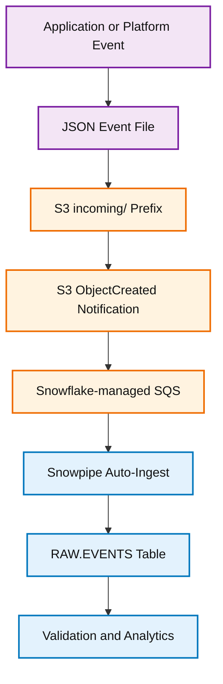
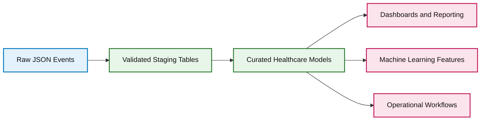

# Architecture and Concepts

**Made by Aakar Gupta**

This guide explains the concepts behind the S3 to Snowflake Snowpipe ingestion pattern.

## Core Idea

The pipeline is built around an event-driven loading model. Instead of manually running `COPY INTO` every time a file lands in S3, Snowpipe reacts to S3 object creation notifications and loads the new file automatically.

```text
File arrival is the trigger.
Snowpipe is the loader.
Snowflake is the analytical destination.
```

## Why Event-Driven Ingestion?

Traditional batch ingestion often waits for a fixed schedule. For example, a job may run every hour or every night. That is simple, but it creates latency. Event-driven ingestion reduces that latency because loading begins shortly after a file lands.

This is useful when teams need fresh data for:

- Operational dashboards
- Healthcare outreach queues
- Care gap monitoring
- Claims processing visibility
- Product and support activity tracking
- Near real-time analytics

## Component Responsibilities

| Component | Responsibility |
|---|---|
| Source system | Produces JSON event files |
| S3 bucket | Stores incoming files durably |
| S3 event notification | Publishes file creation events |
| Snowflake-managed SQS | Carries notifications to Snowpipe |
| Snowpipe | Loads new files into Snowflake |
| External stage | Represents the S3 folder inside Snowflake |
| Storage integration | Provides secure cloud access |
| Target table | Stores the loaded event data |

## Data Flow Diagram



## Why the Raw Table Uses VARIANT

The table has four columns:

```sql
event_id STRING,
event_time TIMESTAMP,
user_id STRING,
payload VARIANT
```

This design keeps frequently used fields easy to query while preserving flexible event details inside `payload`.

For example, claims events may include `claim_id`, appointment events may include `appointment_id`, and care gap events may include `measure_id`. Storing these in `payload` avoids forcing every event type into one rigid table structure.

## How This Supports Healthcare Use Cases

Healthcare platforms often manage multiple workflows:

- Patient risk stratification
- Care gap closure
- Provider panel management
- Appointment scheduling
- Claims monitoring
- Outreach campaigns

These workflows produce different event shapes. A semi-structured ingestion model lets the platform collect all events first, then transform them into curated models later.

## Recommended Layering


