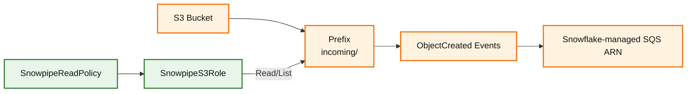

# AWS Setup Guide

**Made by Aakar Gupta**

This guide describes the AWS resources required for the Snowpipe S3 ingestion pipeline.

## Outcome

After completing this guide, AWS will provide:

- A private S3 bucket for incoming event files.
- A restricted `incoming/` prefix for ingestion.
- An IAM policy that grants only the S3 actions Snowflake needs.
- An IAM role that Snowflake can assume through a storage integration.
- An S3 event notification that triggers Snowpipe.

## AWS Architecture



## Required Resources

- S3 bucket
- S3 prefix/folder, recommended: `incoming/`
- IAM policy for Snowflake S3 access
- IAM role for Snowflake to assume
- S3 event notification to Snowflake-managed SQS

## 1. Create S3 Bucket

Create a bucket in your selected AWS region.

Recommended settings:

| Setting | Recommendation |
|---|---|
| Bucket name | `<S3_BUCKET>` |
| Region | `<AWS_REGION>` |
| Object ownership | Bucket owner enforced |
| Block public access | Enabled |
| Versioning | Optional |
| Encryption | SSE-S3 is sufficient for this project |

Create a folder/prefix:

```text
incoming/
```

Expected result:

| Item | Expected State |
|---|---|
| Bucket | Exists and is private |
| Prefix | `incoming/` exists |
| Public access | Blocked |
| Encryption | Enabled using default S3-managed encryption or organization standard |

## 2. Create IAM Policy

Create a customer-managed policy named `SnowpipeReadPolicy`.

Replace `<S3_BUCKET>` before saving.

```json
{
  "Version": "2012-10-17",
  "Statement": [
    {
      "Effect": "Allow",
      "Action": [
        "s3:GetObject",
        "s3:GetObjectVersion",
        "s3:ListBucket",
        "s3:GetBucketLocation"
      ],
      "Resource": [
        "arn:aws:s3:::<S3_BUCKET>",
        "arn:aws:s3:::<S3_BUCKET>/incoming/*"
      ]
    }
  ]
}
```

Why these permissions:

| Permission | Purpose |
|---|---|
| `s3:ListBucket` | Allows Snowflake to list files under the bucket/prefix |
| `s3:GetBucketLocation` | Allows Snowflake to confirm bucket region |
| `s3:GetObject` | Allows Snowflake to read staged files |
| `s3:GetObjectVersion` | Allows reads from versioned objects if versioning is enabled later |

## 3. Create IAM Role

Create an IAM role named:

```text
SnowpipeS3Role
```

Attach `SnowpipeReadPolicy`.

During role creation, AWS requires a trusted entity. You can choose a temporary trusted entity during creation, then replace the trust policy after Snowflake provides its generated principal and External ID.

Expected role ARN pattern:

```text
arn:aws:iam::<AWS_ACCOUNT_ID>:role/SnowpipeS3Role
```

## 4. Update Trust Policy

After running:

```sql
DESC INTEGRATION my_s3_int;
```

Expected result:

| AWS Role Tab | Expected State |
|---|---|
| Permissions | `SnowpipeReadPolicy` attached |
| Trust relationships | Snowflake-generated principal is trusted |
| Condition | `sts:ExternalId` equals the current Snowflake External ID |

copy these values:

- `STORAGE_AWS_IAM_USER_ARN`
- `STORAGE_AWS_EXTERNAL_ID`

Then update the role trust policy:

```json
{
  "Version": "2012-10-17",
  "Statement": [
    {
      "Effect": "Allow",
      "Principal": {
        "AWS": "<STORAGE_AWS_IAM_USER_ARN>"
      },
      "Action": "sts:AssumeRole",
      "Condition": {
        "StringEquals": {
          "sts:ExternalId": "<STORAGE_AWS_EXTERNAL_ID>"
        }
      }
    }
  ]
}
```

## 5. Configure S3 Event Notification

After creating the Snowpipe, run:

```sql
SHOW PIPES LIKE 'MY_EVENTS_PIPE' IN SCHEMA INGEST_DB.RAW;
```

Copy the `notification_channel` value and use it as the SQS destination in S3 event notification setup.

Recommended notification values:

| Field | Value |
|---|---|
| Event name | `SnowpipeAutoIngest` |
| Prefix | `incoming/` |
| Suffix | Leave blank |
| Event type | All object create events |
| Destination | SQS queue |
| SQS ARN | Value from Snowflake `notification_channel` |

## Common AWS Checks

| Check | Why |
|---|---|
| Bucket region matches project region | Avoids cross-region confusion |
| Prefix is exactly `incoming/` | Must match Snowflake stage URL and S3 notification prefix |
| Suffix is blank | Allows all JSON test files to trigger the pipe |
| Role ARN account ID is correct | Snowflake must assume the role in the actual AWS account |
