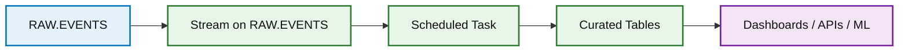

# Future Extensions

This guide describes how the project can evolve after the initial Snowpipe ingestion layer is working.

## 1. Curated Healthcare Tables

The raw `EVENTS` table is intentionally flexible. A production-style implementation would add curated tables for specific business entities.

Possible curated tables:

| Table | Purpose |
|---|---|
| `CURATED.PATIENT_EVENTS` | Patient profile, enrollment, and risk updates |
| `CURATED.CARE_GAPS` | Open, closed, and reassigned care gaps |
| `CURATED.APPOINTMENTS` | Scheduled, cancelled, and completed visits |
| `CURATED.CLAIMS` | Claims received, adjudicated, paid, or denied |
| `CURATED.PROVIDER_PANEL` | Provider capacity and attributed patient panels |
| `CURATED.OUTREACH_EVENTS` | Campaign sends, responses, failures, and conversions |

## 2. Streams and Tasks

Snowflake streams and tasks can transform raw events continuously.

## 3. Data Quality Framework

Recommended checks:

- `event_id` is not null.
- `event_time` parses successfully.
- `payload:event_type` is present.
- `payload:source_system` is present for platform events.
- Healthcare identifiers are synthetically generated in test data.
- No raw PHI is committed to source control.

## 4. Gravity-Style Platform Link

The test data is shaped so it can later represent event exports from a healthcare workflow platform.

Potential integration directions:

- Load Gravity-style care gap events into Snowflake.
- Join care gap events with claims and appointment data.
- Build patient outreach effectiveness metrics.
- Track provider panel risk and capacity.
- Feed curated results into dashboards or downstream APIs.

## 5. Snowflake Enhancements

Snowflake features that can be added later:

| Feature | Use Case |
|---|---|
| Streams | Detect new raw rows for transformation |
| Tasks | Schedule transformations without external orchestration |
| Dynamic Tables | Maintain continuously refreshed derived tables |
| Snowpark | Add Python or Scala processing logic |
| Cortex | Explore AI-assisted summarization or classification |
| Row access policies | Secure sensitive domain data |
| Masking policies | Protect identifiers in shared environments |

## 6. Production Hardening

Before production use:

- Create separate dev/test/prod environments.
- Use Infrastructure as Code.
- Add CI checks for SQL scripts.
- Add monitoring and alerting for pipe failures.
- Add dead-letter handling for malformed files.
- Add schema versioning for event payloads.
- Define data retention and lifecycle rules.
