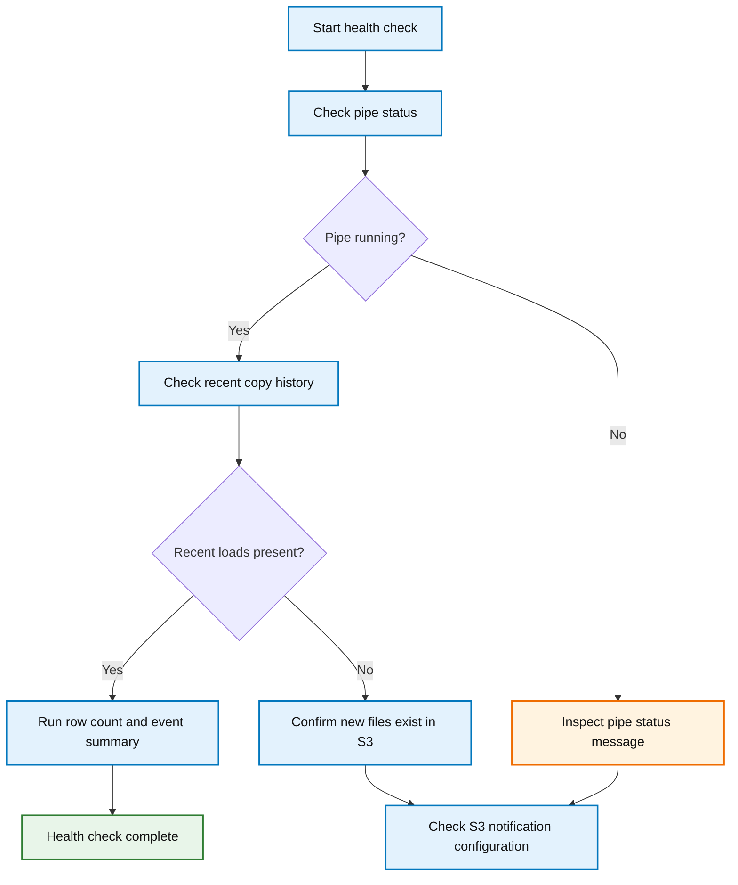

# Operations Runbook

**Made by Aakar Gupta**

This runbook provides day-to-day checks for the Snowpipe S3 ingestion pipeline.

## Runbook Purpose

The runbook is meant for operators or developers who need to confirm that the ingestion pipeline is healthy after deployment.

## Daily Health Checks

### 1. Pipe Status

```sql
SELECT SYSTEM$PIPE_STATUS('INGEST_DB.RAW.MY_EVENTS_PIPE');
```

Look for:

- Running execution state
- Low or zero pending file count
- No repeated error messages

Expected healthy signal:

```json
{
  "executionState": "RUNNING",
  "pendingFileCount": 0
}
```

### 2. Recent Loads

```sql
SELECT *
FROM TABLE(INFORMATION_SCHEMA.COPY_HISTORY(
  TABLE_NAME => 'EVENTS',
  START_TIME => DATEADD(DAY, -1, CURRENT_TIMESTAMP())
))
ORDER BY LAST_LOAD_TIME DESC;
```

Expected output:

| Output Area | Healthy Signal |
|---|---|
| File names | Recent objects from `s3://<S3_BUCKET>/incoming/` are visible |
| Load status | Files show successful load status |
| Row count | Loaded files show rows greater than zero |
| Error fields | No repeated parse, permission, or stage access errors |

### 3. Recent Row Count

```sql
SELECT
  DATE_TRUNC('HOUR', event_time) AS event_hour,
  COUNT(*) AS row_count
FROM INGEST_DB.RAW.EVENTS
GROUP BY 1
ORDER BY 1 DESC;
```

Expected output:

| event_hour | row_count |
|---|---:|
| Recent ingestion hour | Greater than zero after test upload |

## Deployment Checklist

- [ ] S3 bucket exists.
- [ ] `incoming/` prefix exists.
- [ ] IAM policy has S3 read/list permissions.
- [ ] IAM role exists.
- [ ] Storage integration points to the correct IAM role ARN.
- [ ] AWS trust policy matches current `DESC INTEGRATION` values.
- [ ] Stage can list files.
- [ ] Pipe exists with `AUTO_INGEST = TRUE`.
- [ ] S3 event notification points to the Snowpipe notification channel.
- [ ] Test files load into `RAW.EVENTS`.

## Operational Flowchart



## Common Maintenance Tasks

### Rotate Storage Integration External ID

1. Recreate or alter the storage integration according to your security process.
2. Run:

```sql
DESC INTEGRATION my_s3_int;
```

3. Copy the latest Snowflake principal and External ID.
4. Update the AWS role trust policy.
5. Run:

```sql
LIST @RAW.my_s3_stage;
```

### Replay a Test Batch

Snowpipe tracks loaded file names. To replay test data, upload files using new object names or use a controlled reset process.

For table-only reset:

```sql
TRUNCATE TABLE INGEST_DB.RAW.EVENTS;
```

Then upload a new test batch with unique object names.

Expected result after replaying the full included test set into a clean table:

| total_loaded_rows |
|---:|
| 27 |

## Production Hardening Ideas

- Use Infrastructure as Code for AWS and Snowflake resources.
- Add separate dev/test/prod buckets and schemas.
- Add row-level data quality checks.
- Add curated downstream tables for claims, care gaps, appointments, and outreach.
- Monitor pipe usage and load errors.
- Avoid placing real PHI in raw test data or public repositories.
