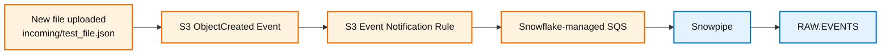

# S3 Event Notification Guide

**Made by Aakar Gupta**

This guide explains how to connect S3 object creation events to Snowpipe.

## Purpose

Snowpipe auto-ingest depends on event notifications. The pipe exists in Snowflake, but S3 must still tell Snowflake when new files arrive. This guide configures S3 so every new object under `incoming/` sends a notification to the Snowflake-managed SQS queue.

## Event Flow



## Prerequisite

Snowpipe must already exist. Run:

```sql
SHOW PIPES LIKE 'MY_EVENTS_PIPE' IN SCHEMA INGEST_DB.RAW;
```

Copy the `notification_channel` value. It is a Snowflake-managed SQS ARN.

## AWS Console Steps

1. Open the S3 bucket.
2. Go to **Properties**.
3. Open **Event notifications**.
4. Create an event notification.

Use these settings:

| Field | Value |
|---|---|
| Event name | `SnowpipeAutoIngest` |
| Prefix | `incoming/` |
| Suffix | Leave blank |
| Event type | All object create events |
| Destination | SQS queue |
| SQS queue option | Enter SQS queue ARN |
| SQS ARN | `<NOTIFICATION_CHANNEL_ARN>` |

## Important Notes

- Leave suffix blank unless every file has the same required extension.
- Use the exact `notification_channel` from Snowflake.
- The SQS queue is managed by Snowflake, so you do not create it manually.
- S3 publishes object creation events; Snowpipe uses those events to discover files.

## Expected Result

After saving, the S3 bucket should show an event notification similar to:

| Field | Expected Value |
|---|---|
| Name | `SnowpipeAutoIngest` |
| Event types | `s3:ObjectCreated:*` |
| Prefix | `incoming/` |
| Destination type | SQS |
| Destination ARN | Snowflake-managed SQS ARN |

## Validation

After saving the notification:

1. Upload a JSON file to `incoming/`.
2. Wait briefly.
3. Run:

```sql
SELECT SYSTEM$PIPE_STATUS('INGEST_DB.RAW.MY_EVENTS_PIPE');

SELECT COUNT(*) AS total_loaded_rows
FROM INGEST_DB.RAW.EVENTS;
```
